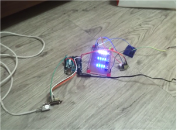
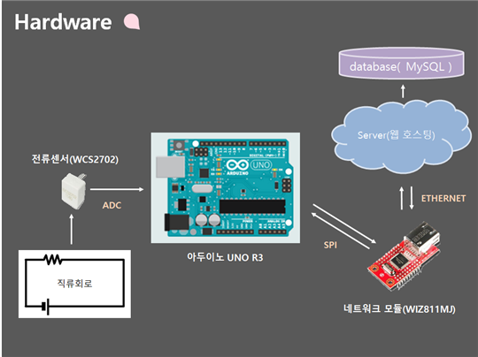
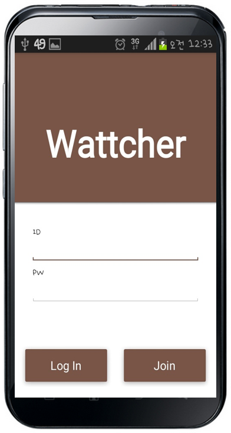
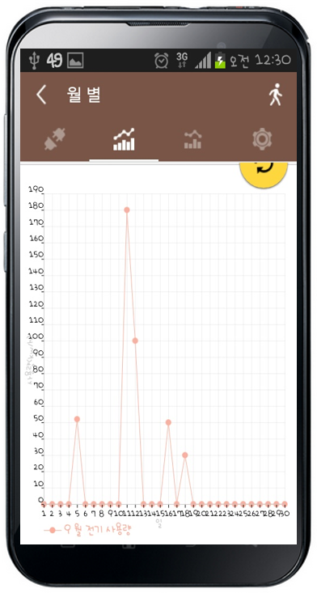
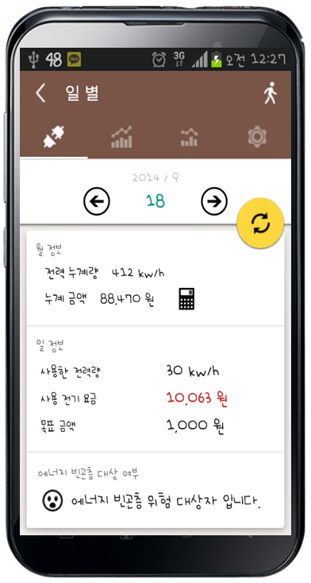

# hanium_2014

### 2014 한이음 공모대전 참가 프로젝트

### 프로젝트 개요 :  
**[한이음지정공모-LG CNS]에너지 절감 공모전 대비**  
여러 에너지들 중 전기에너지에 초점을 맞춰 에너지 빈곤층 자각 + 효율적인 에너지 관리를 할 수 있는 시스템 구현.  
Arduino와 Server, Android 애플리케이션으로 실시간 사용 전력을 측정할 수 있는 시스템 Wattcher 구축.

### 기간 : 2014.05 ~ 2014.12

### 역할 : 총 4명 중 **팀원** 역할, 프로젝트 총괄 및 개발

### 주요 기능 :
- Arduino
	- 전류센서로 전력을 측정하여 이더넷 모듈을 통해 서버에 데이터를 전송
	- 고유 번호를 설정하여 전력 측정 값의 데이터를 구분
- Server
	- Arduino 에서 측정한 데이터를 받기 위해 php로 API 구현
	- Android 애플이케이션과 데이터를 송/수신 하기 위해 php로 API 구현
	- 데이터 관리를 위한 MySQL 데이터베이스 구축
- Android
	- 회원제 시스템을 도입하여 사용자 개개인 데이터를 확인할 수 있음
	- Server와 HTTP 통신하여 Arduino에서 측정한 전력값을 실시간으로 그래프 확인 가능
	- 전력 누계량 및 금액을 확인할 수 있으며, 에너지 빈곤층 여부를 확인할 수 있음

#### **사용 기술** : `Android Java`, `php`, `MySQL`, `Arduino`

#### **사용 툴** : `Arduino IDE`, `Eclipse`, `Sublime Text2`

#### [보고서][1]

### SCREEN SHOT
-------

 
  
  

[1]: ppt/hanium_2014.pdf